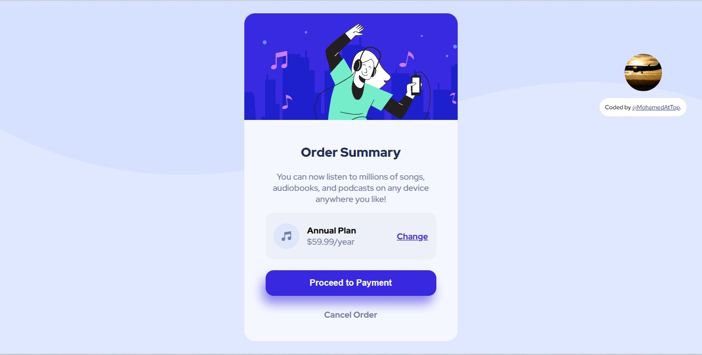

# Frontend Mentor - Order summary card solution

This is a solution to the [Order summary card challenge on Frontend Mentor](https://www.frontendmentor.io/challenges/order-summary-component-QlPmajDUj). Frontend Mentor challenges help you improve your coding skills by building realistic projects.

## Table of contents

- [Overview](#overview)
  - [The challenge](#the-challenge)
  - [Screenshot](#screenshot)
- [My process](#my-process)
  - [Built with](#built-with)
  - [What I learned](#what-i-learned)
  - [Continued Development](#Continued-development)
- [Author](#author)

## Overview

### The challenge

Users should be able to:

- See hover states for interactive elements

**This is an Order summary card solution, I used flex box but I can't use grid, It was AN EASY program and I enjoyed programming it.**

### Screenshot



## My process

### Built with

- Semantic HTML5 markup
- CSS custom properties
- Flexbox

**It is not fully responsive.**

### What I learned

I learned new things about the background settings like :

```css
body {
  background-repeat: no-repeat;
  background-position: 0 -110px;
}
```

### Continued development

IN this project the dimensions are not correct and the website in mobile is not Exactly set.

## Author

- Website - [Order summary card solution](https://mohamedattop.github.io/Order-summary-card-solution/)
- Frontend Mentor - [@MohamedAtTop](https://www.frontendmentor.io/profile/MohamedAtTops)
